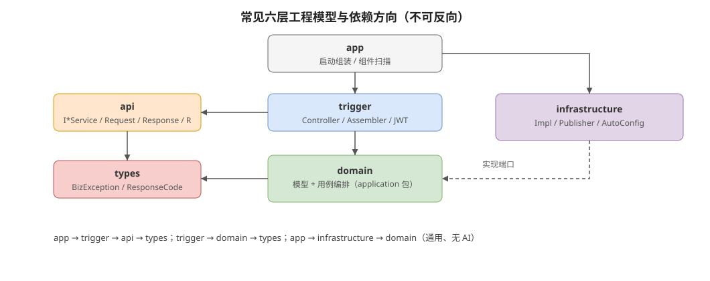

# hei-ddd-lite

最基础的 **DDD 单体模板脚手架**：完整核心抽象 + 五层模块约定 + 可选基础设施自动配置。  
坐标：`io.github.jiangbyte` / `io.github.jiangbyte.hei.*`。

**做齐：** Entity、ValueObject、AggregateRoot（含事件登记）、DomainEvent、DomainEventPublisher、Repository、DomainService、Factory、Specification、ApplicationService、Command / Query、分层依赖倒置。  
**刻意不做：** Event Sourcing、Saga、强制 CQRS 总线、ACL、多限界上下文拆分。

架构图源文件见 [`docs/diagrams/*.drawio`](docs/diagrams/)（可用 [diagrams.net](https://app.diagrams.net/) 打开编辑）；README 嵌入对应 SVG。

---

## 1. 模块结构

```text
hei-ddd-lite/
├── domain/            # 领域内核 + 占位模型（无 Spring）
├── application/       # 用例编排 / Command / Query
├── interfaces/        # Controller / DTO / JWT / 统一响应
├── infrastructure/    # 仓储实现 / 事件发布 / 可选 AutoConfig
└── bootstrap/         # 启动入口
```

---

## 2. 模块与分层架构



| 层 | 放什么 | 不放什么 |
|----|--------|----------|
| domain | 实体/聚合、值对象、领域事件、仓储端口、工厂、规约、领域服务、领域异常 | Spring、HTTP、SQL |
| application | 用例编排、事务边界、Command/Query、应用读模型 | 对外 API DTO、技术细节 |
| interfaces | Controller、Response、Assembler、统一响应 `R`、`@RequireLogin` / JWT | 业务规则、持久化 |
| infrastructure | 仓储实现、事件发布、Redis/MP/MinIO 等可选配置 | 领域规则 |
| bootstrap | 启动类、`application.yml`、组件扫描范围 | 业务逻辑 |

依赖方向（**不可反向**）：

```text
bootstrap → interfaces → application → domain
bootstrap → infrastructure → domain / application
```

JWT / CORS 属于 **interfaces** 技术能力；Druid / MyBatis / Redis / MinIO 属于 **infrastructure** 可选能力，都不是领域内核。

---

## 3. DDD 核心概念


| 抽象 | 包位置 | 扩展时怎么用 |
|------|--------|----------------|
| `Entity` | `domain.core` | 有标识、可变；按 ID 相等 |
| `ValueObject` | `domain.core` | 不可变、按值相等；参考 `Greeting` |
| `AggregateRoot` | `domain.core` | 继承它；行为内 `registerEvent` |
| `DomainEvent` | `domain.core` | 不可变事实；参考 `HelloCreatedEvent` |
| `DomainEventPublisher` | `domain.core` | 领域端口；infra 提供 `SpringDomainEventPublisher` |
| `Repository` | `domain.core` | 以聚合为粒度；端口在 domain，实现在 infra |
| `Factory` | `domain.core` | 创建合法聚合；参考 `HelloFactory` |
| `Specification` | `domain.core` | 可复用判定；参考 `GreetingNotBlankSpecification` |
| `DomainService` | `domain.core` | 跨聚合无状态规则；单聚合行为放聚合根 |
| `ApplicationService` | `application.core` | 编排用例 + `@Transactional` |
| `Command` / `Query` | `application.core` | 写/读用例入参 |

包级约定见各模块 `package-info.java`。

---

## 4. 基于本脚手架开发


按 Hello 占位竖切复制即可：

1. **领域模型**（`domain.model`）：新建聚合继承 `AggregateRoot`，值对象实现 `ValueObject`。
2. **Factory / Event / Spec**（`domain.factory` / `event` / `specification`）：创建时校验并登记创建事件。
3. **Repository 端口**（`domain.repository`）：`XxxRepository extends Repository<Xxx, ID>`。
4. **应用服务**（`application`）：`CreateXxxCommand` / `GetXxxQuery` + `XxxApplicationService`（事务边界）。
5. **基础设施**（`infrastructure.persistence` / `event`）：实现仓储与事件发布；默认内存仓储可替换为 DB。
6. **接口**（`interfaces.web`）：Controller + Assembler + Response。
7. **启动**：若新增需扫描的 infra 包，更新 `HeiDddLiteApplication` 的 `scanBasePackages`。

### 领域事件约定


1. 聚合行为内 `registerEvent(...)`。
2. 应用服务 `repository.save(aggregate)`。
3. `aggregate.pullDomainEvents()` 取出并清空。
4. `domainEventPublisher.publish(events)`。

事务边界在**应用服务**；脚手架默认同步 Spring 事件发布，可替换为 Outbox / MQ，调用方式不变。

### 何时用 DomainService / Factory / Specification

- **Factory**：构造复杂或必须保证不变式的聚合创建。
- **Specification**：多处复用的业务判定，避免散落 if。
- **DomainService**：规则不属于单一聚合（跨聚合协作），且仍是纯领域逻辑。

---

## 5. 快速启动

需 **JDK 21**：

```bash
export JAVA_HOME=/home/charlie/Workspace/sdks/jdk-21
export PATH="$JAVA_HOME/bin:$PATH"
mvn install -DskipTests
mvn -pl bootstrap spring-boot:run
```

公开问候：

```bash
curl http://localhost:8080/hello
```

创建并查询 Hello（走工厂 → 仓储 → 领域事件）：

```bash
curl -X POST 'http://localhost:8080/hello?greeting=hei'
curl http://localhost:8080/hello/1
```

登录并访问需鉴权接口：

```bash
TOKEN=$(curl -s -X POST 'http://localhost:8080/auth/login?username=admin' | sed -n 's/.*"token":"\([^"]*\)".*/\1/p')
curl -H "Authorization: Bearer $TOKEN" http://localhost:8080/hello/secure
```

---

## 6. 可选基础设施

`infrastructure` 中通过 **classpath + 配置开关** 启用。示例见 `bootstrap/src/main/resources/application.yml`。

| 能力 | 依赖示例 | 开关 |
|------|----------|------|
| 数据源 | `druid-spring-boot-4-starter` + 驱动 | `hei.ddd.datasource.enabled` |
| MyBatis-Plus | `mybatis-plus-spring-boot4-starter` | `hei.ddd.mybatis.enabled` |
| Redis | `spring-boot-starter-data-redis` | `hei.ddd.redis.enabled` |
| JWT | 已内置于 `interfaces`（jjwt） | `hei.ddd.jwt.enabled` |
| MinIO | `minio` | `hei.ddd.minio.enabled` |

默认 `HelloRepositoryImpl` 为**内存实现**，开箱可跑。接真库时：保留 `HelloRepository` 端口，替换实现，并启用 datasource / mybatis；接入真实 `PlatformTransactionManager` 后可移除 `infrastructure.tx` 占位配置。

版本在父 POM `<properties>` 中用 `${xxx.version}` 统一管理。

---

## 7. 「不做」清单

避免把脚手架堆成完整 DDD 平台：

- 不做 Event Sourcing / 事件溯源存储
- 不做 Saga / 流程编排框架
- 不做强制 CQRS 总线（Command/Query 仅为入参约定）
- 不做 ACL / 防腐层脚手架
- 不做多限界上下文工程拆分（单示例上下文足够起步）

---

## 技术栈

- Java 21 / Spring Boot 4.1.x / Maven 多模块
- Lombok / Hutool / MapStruct / JJWT
- Druid / MyBatis-Plus / Redis / MinIO（可选）
